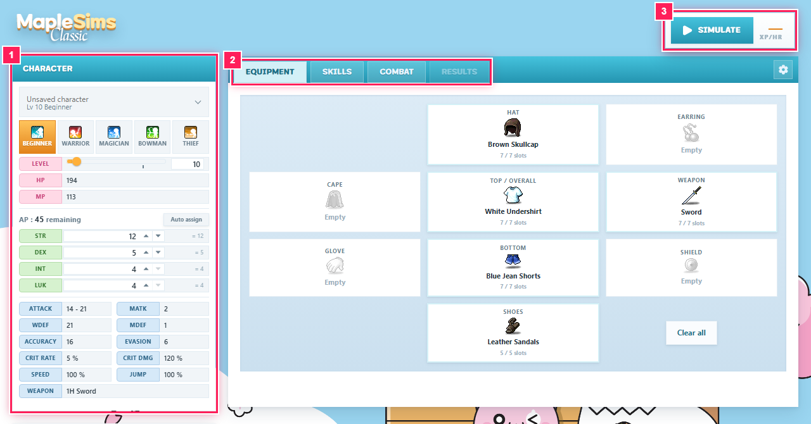
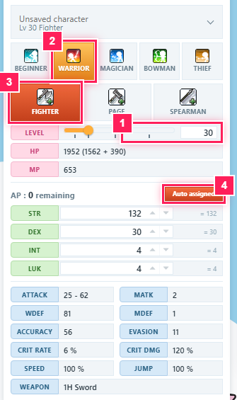
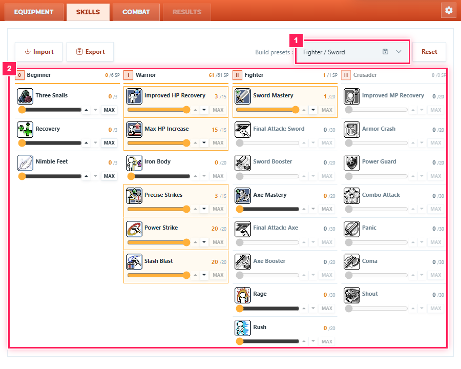
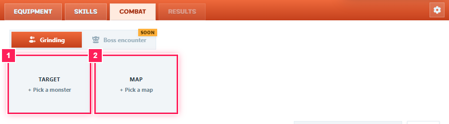
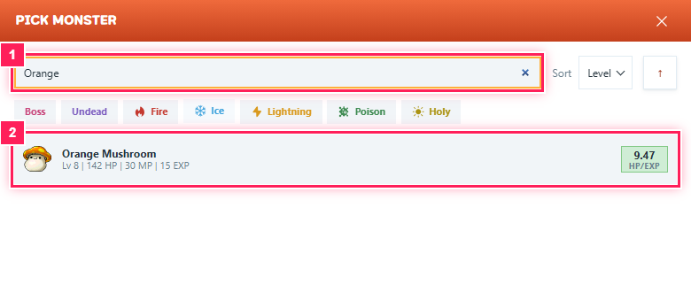
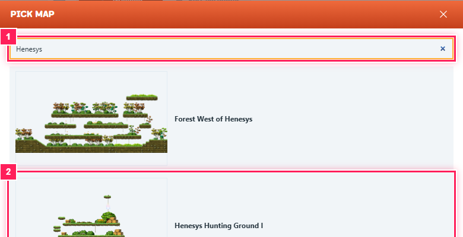
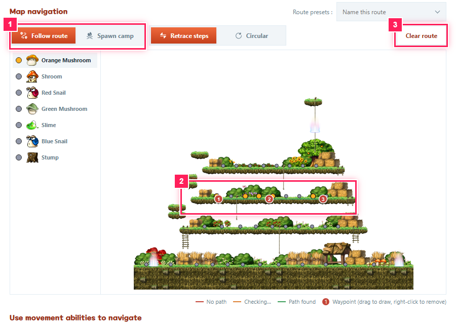
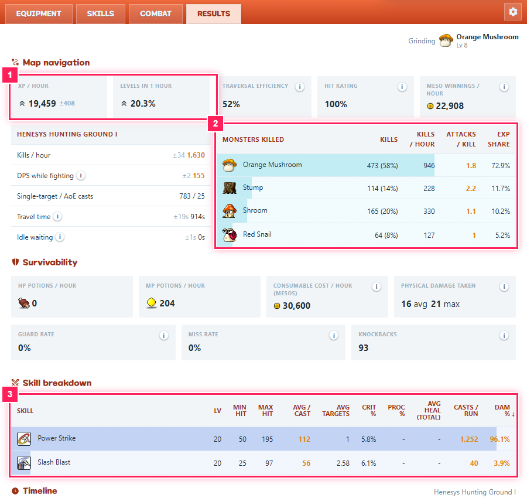
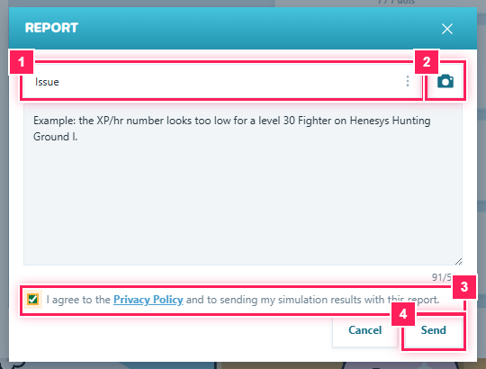

# MapleSims Classic

MapleSims is a damage and leveling simulator for **MapleStory Classic World**. You build a
character, choose a monster and a map, and the simulator tells you how fast that character levels
there: experience per hour, kills per hour, damage per skill, potion use and more.

This repository holds the **user guide and the public issue tracker**. If something looks wrong or you
want a feature, jump to [Reporting bugs and suggestions](#reporting-bugs-and-suggestions).

https://maplesims.enroy.space/

## Contents

- [Coming soon](#coming-soon)
- [How to use it: a step-by-step guide](#how-to-use-it-a-step-by-step-guide)
- [Reporting bugs and suggestions](#reporting-bugs-and-suggestions)

## Coming soon

These are in progress or planned and are not usable yet. Follow their progress on the
[MapleSims project board](https://github.com/orgs/maplesims/projects/1).

- Boss encounters, with boss-specific mechanics
- Party play, with shared buffs and EXP
- Comparing simulation results side by side
- Monster drop tables and estimated drop income
- Job and map leveling rankings
- A gear score rating for equipment

## How to use it: a step-by-step guide

No game-theory knowledge needed. The whole flow is five steps, left to right across the page:
**build your character, learn skills, choose where to fight, simulate, read the results.**

In the screenshots, the pink boxes with numbers mark the parts to look at.

### Step 1. Find your way around

When the page opens you see two areas:

- **Left: the Character panel.** Your level, HP/MP, AP, stats and class.
- **Right: four tabs.** **Equipment**, **Skills**, **Combat** and **Results**. Results unlocks after your first simulation.

The big **Simulate** button in the top right runs the simulation. After a run it also shows your
headline number (XP per hour).

### Step 2. Pick a level and a class

1. Type your **level** in the Level box, or drag the slider. Set the level first: changing it later resets your class choice.
2. Click your class: **Warrior**, **Magician**, **Bowman** or **Thief**. A row of job advancements appears (for a Warrior: Fighter, Page, Spearman).
3. Click the **job** you want, for example **Fighter**.
4. Click **Auto assign** to spend your AP on stats that fit the class. You can also type stat values by hand or use the arrows.

The panel below shows the resulting HP, MP, attack, accuracy, crit and more, so you can see what your
choices do straight away.

Optional: open the **Equipment** tab to change gear. Click any slot to swap an item or upgrade it.
Starter gear is fine for a first try.

### Step 3. Spend your skill points

Open the **Skills** tab. Every job you have unlocked shows its skills with a slider and a **MAX** button.

- The **Build presets** drop-down (top right) loads a ready-made build such as *Fighter / Sword*. This is the quickest way to start.
- Or set skill levels yourself with the sliders.
- **Reset** clears everything. **Export** and **Import** turn your build into a code you can share or load.

### Step 4. Choose what to fight and where

Open the **Combat** tab. Leave the mode on **Grinding** (Boss encounter is coming soon).

**a) Pick a monster.** Click the **Target** card. Search by name, or sort and filter by element. The
green number on each row is HP per EXP, a quick measure of how rewarding the monster is. Click one to
select it.

**b) Pick a map.** Click the **Map** card and search for a map, for example *Henesys*. Click a map
to select it.

**c) Draw a route.** The map appears with the monsters that spawn there. Click and **drag across
the map** on a platform to draw a path of numbered waypoints. Your character walks that path while
fighting. Right-click a waypoint to remove it, or press **Clear route** to start again.

- **Follow route** walks your waypoints. **Spawn camp** stays in one place.
- **Retrace steps** and **Circular** decide what happens at the end of the route.
- The line colour shows whether a path exists: green means a path was found.

> The Simulate button needs a route. If the Map card flashes red when you click Simulate, draw a route first.

Scroll down on the Combat tab for the **rotation**: the list of skills your character uses, in
priority order. A sensible default is already filled in. Add blocks (**Keep up**, **Attack**,
**Use skill**, **If**, **While**) to customise it. Skills you have not learned are skipped.

### Step 5. Simulate and read the results

Press **Simulate**. A moment later the **Results** tab opens:

- **Map navigation:** XP per hour, levels gained in one hour, meso winnings per hour and a table of which monsters you killed.
- **Survivability:** potions used per hour, damage taken and knockbacks.
- **Skill breakdown:** damage per skill, hit counts and crit rate.
- **Timeline:** a replay of the run. Press play, change the speed or scrub the minimap.

Change anything (level, gear, skills, route, rotation) and press **Simulate** again to see the
difference. Keep an eye on the big XP/hr number in the top right while you experiment.

### Tips

- Hover over any skill or stat with an **i** icon to read what it means.
- The **gear icon** in the top right of the tabs opens the settings (the app also has a light and dark theme).
- Use **Save character** and **Open Character** (the drop-down at the top of the Character panel) to keep your builds.
- The **About** card at the bottom of the left panel shows the app version and the game data version (for example `cot2-12.08.26`). Include both when you report a problem.

## Reporting bugs and suggestions

Two ways to reach the maintainers. Use whichever you prefer.

### Option A: the built-in report button (fastest)

The report form attaches your current build and run automatically, so we can reproduce what you saw.

1. Scroll to the bottom of the left Character panel, under the **About** card.
2. Click **send feedback** (the bug icon).
3. Choose a **type**: *Issue* for a bug, *Suggestion* for an idea, or *Other*.
4. Describe what happened and what you expected (up to 500 characters).
5. Optional: click the **camera** button, then drag over the part of the page you want to show. A screenshot is attached.
6. Tick **I agree to the Privacy Policy** (click the link to read it first). The report includes your simulation results.
7. Click **Send**.

### Option B: GitHub Issues in this repository

Use this if you want to follow the discussion, add details later, or you do not want to send your build data.

1. Go to the **[Issues tab](../../issues)** of this repository.
2. Search first: your bug or idea may already be listed. Add a 👍 or a comment instead of opening a duplicate.
3. Click **New issue** and choose **Bug report** or **Feature request**.
4. Fill in the template:
   - **Bug report:** what went wrong, the steps to reproduce it, what you expected, your browser and OS, plus the app version from the About card.
   - **Feature request:** the problem you have, the solution you would like, and any alternatives.
5. Add screenshots if they help, then click **Submit new issue**.

A good report is specific. "Fighter XP/hr is 0 on Henesys Hunting Ground I after clearing the route"
helps far more than "results are wrong".
